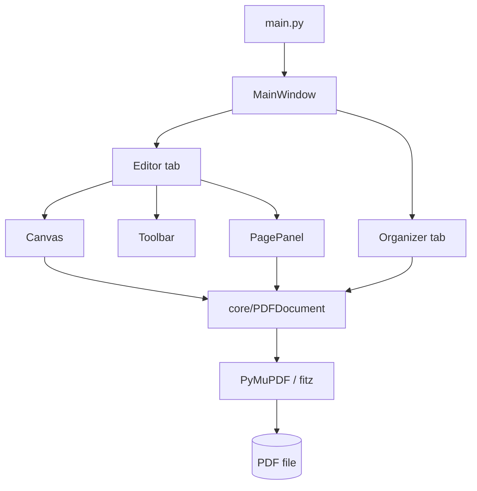

# rapid-pdf

A fast, focused desktop PDF editor for page management and visual markup. No OCR, no form-field scanning, no wait.

## What it is

Acrobat runs OCR and form-field detection every time it opens a file, which makes large technical PDFs slow to work with. rapid-pdf does only the two things that matter for field work, reorganizing pages and adding markup, and does them instantly. Open an A1 engineering drawing, move or delete pages, drop highlights and shapes, and save, all without the wait.

Built in Python with PySide6 (Qt6) and PyMuPDF. Single window, dark theme, Windows-first.

## Key features

- **Page manager**: open, combine, reorder, delete, and add pages from a thumbnail grid.
- **Markup tools**: highlight, rectangle, and line annotations with an Office-style color picker, opacity presets, and line weights.
- **Object editing**: select, move, resize with 8-point handles, Ctrl+drag to duplicate, marquee group-select, copy/paste, and full undo/redo.
- **Embedded-image lift**: grab an image baked into the page and move or resize it like any other object, with no white hole left behind.
- **Text in shapes**: double-click any shape to add auto-fitting text.
- **Faithful saves**: markup is written as PDF-spec annotation objects on top of the original page. Nothing is re-encoded, resized, or clipped, and existing annotations are preserved.
- **Editable round-trip**: a document saved by rapid-pdf reopens with its objects still movable and editable (the model travels embedded in the PDF).

## Quickstart

```bash
pip install -r requirements.txt
python main.py            # or: python main.py path/to/file.pdf
```

On Windows you can also run `run.bat`, which uses the bundled `.venv`.

## Architecture



`MainWindow` owns the lifecycle and two tabs. The **Editor** holds the page panel (thumbnail strip), the canvas (the annotation surface), and the toolbar. The **Organizer** is a drag-to-reorder page grid. Everything reads and writes through `core/PDFDocument`, a thin wrapper over PyMuPDF that owns rendering, the page cache, saves, and the embedded annotation model.

See [Architecture](docs/architecture.md) for the full walkthrough.

## File structure

```
rapid-pdf/
├── main.py            # entry point: builds the app, opens a CLI-passed PDF
├── core/
│   └── pdf_document.py  # PyMuPDF wrapper: render cache, save lifecycle, annotation model
├── ui/
│   ├── main_window.py   # window, menus, tabs, save/open lifecycle, dirty-state
│   ├── canvas.py        # the editor: annotation items, undo stack, image lift, marquee
│   ├── toolbar.py       # tools and contextual color/opacity/weight controls
│   ├── organizer.py     # page reorder / delete / add grid
│   └── page_panel.py    # left-hand thumbnail strip
├── docs/              # architecture, performance, UI, build, shortcuts, PRD
├── prototypes/        # throwaway UI restyle preview (not shipped)
├── requirements.txt   # pymupdf, PySide6
└── run.bat            # Windows launcher using the bundled .venv
```

Full annotated tree: [File structure](docs/file-structure.md).

## Tech stack

[Python](https://www.python.org/) 3.11+ · [PySide6](https://doc.qt.io/qtforpython/) (Qt6) · [PyMuPDF](https://pymupdf.readthedocs.io/) (fitz)

## Install

Download the latest **rapid-pdf-setup** from the [Releases page](https://github.com/lucasrucu/rapid-pdf/releases/latest) and run it. It's a per-user install (no admin prompt), adds a Start-menu entry and an optional desktop shortcut, and registers an uninstaller in Add/Remove Programs. Prefer no install? Grab the portable zip from the same release, unzip it anywhere, and run `rapid-pdf.exe`.

The installer is currently unsigned, so Windows SmartScreen may show a "Windows protected your PC" prompt on first run. Click **More info -> Run anyway**. Code signing is on the roadmap (see `docs/build.md`).

## Updating

GitHub Releases is the single source of truth for versions. The strategy rolls out in stages:

- **Now:** download the newest release and reinstall over the top. The installer keeps a stable app id, so it upgrades in place and your shortcuts stay put.
- **Near-future:** an in-app update check. On launch the app queries the GitHub Releases API, compares the latest tag against its own version using semver, and acts by bump type: a patch or minor offers a one-click "update available" prompt, a major shows the release notes and requires explicit confirmation before updating.
- **Later:** a full background auto-updater (for example PyUpdater), still backed only by GitHub Releases, so there's no server to run. It downloads and stages the new version, then applies it on the next restart.

## Documentation

- [Architecture](docs/architecture.md): modules, coordinate system, save lifecycle, image-lift pipeline.
- [File structure](docs/file-structure.md): annotated tree of every file and its role.
- [Performance & rendering](docs/performance.md): page cache, lazy thumbnails, debounce/settle, save integrity.
- [UI direction](docs/ui.md): styling options and the recommended path.
- [Build & packaging](docs/build.md): freezing to an installable Windows app.
- [Keyboard & mouse shortcuts](docs/shortcuts.md): every key and gesture.
- [Product requirements](docs/PRD.md): the problem, target user, and feature scope.
