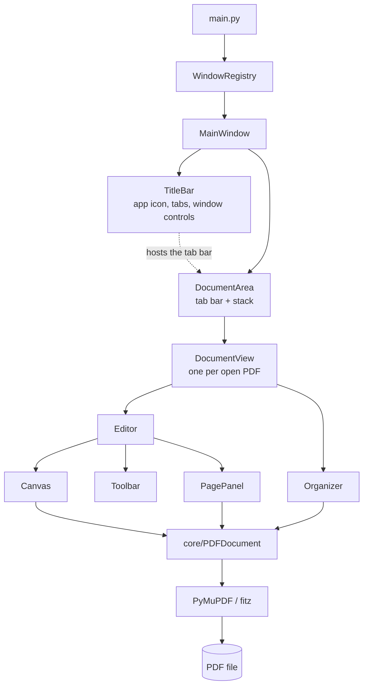

# Rapid PDF

A fast, focused desktop PDF editor for page management and visual markup. OCR when you ask for it, never on open. No wait.

## What it is

Acrobat runs OCR and form-field detection every time it opens a file, which makes large technical PDFs slow to work with. Rapid PDF opens the file and nothing else, then does the two things that matter for field work, reorganizing pages and adding markup, instantly. Open an A1 engineering drawing, move or delete pages, drop highlights and shapes, and save, all without the wait. OCR is still there when a scan needs to be searchable, but it runs only when you pick it off the File menu.

Built in Python with PySide6 (Qt6) and PyMuPDF. Tabs in the title bar, several windows, light and dark, Windows-first.

## Key features

- **Tabs in the title bar**: several PDFs open at once, one tab each, on the top row of the window the way Chrome does it, so the strip you grab to drag the window is the strip the documents sit on. There is no separate title bar above them and no window title text, because the document names are already on the tabs. Snap Layouts, the system menu on right click or `Alt+Space`, and resizing from every edge all still work. Tabs are named by filename and disambiguated by folder when two match. `Ctrl+T` or the `+` button opens one, middle-click closes one, `Ctrl+Tab` walks the tabs you were just in, and opening a file that is already open raises its tab instead of opening a second copy.
- **Several windows**: `Ctrl+Shift+N` for a new one, or drag a tab off the bar and it tears into a window that appears under the cursor and follows it. Drop it on another window's tab bar to dock it there.
- **Pages between tabs**: drag a page out of one document's thumbnail strip or Organizer and into another's in the same window, `Ctrl` at the drop to copy instead of move. One undoable action across both documents, with unsaved markup carried along.
- **Session restore**: optionally reopen the windows and tabs you had open last time, with each document read when you first look at it rather than all at once. Off by default, under Startup in Preferences.
- **Page sharpness that follows the page**: A4 and Letter render at 3.0, A3 at 2.0, and A2, A1 and A0 stay at 1.5, because raster cost is quadratic in scale and a sharp A1 costs around four times the memory on the most expensive page the app ever draws. Small scanned text is readable without the drawings getting slower. Override it under View in Preferences: Automatic, Standard, Sharp or Sharpest, applied to documents you open afterwards.
- **Find, and OCR on demand**: `Ctrl+F` searches the document. `File > Enhance for Search (OCR)…` adds a text layer to the pages that lack one, when you ask and not before, which is why opening a file is instant in the first place.
- **Opens how you expect**: drop a PDF on a window and it opens as a tab there, `Ctrl+O` opens several at once, and selecting a few in Explorer and picking Combine with Rapid PDF merges them.
- **Getting around**: pan with `H`, by holding `Space`, or with a middle-button drag, and four icon buttons in the status bar for fit page, fit width, fit height and 100%. Type a page number into the box at the right of the status bar and press Enter to land on it.
- **Preferences** (`Ctrl+,`): startup, closing, theme, where file dialogs open, the page panel, the default fit and page sharpness, on one page, kept in `%LOCALAPPDATA%\Rapid PDF\settings.json`.
- **Page manager**: open, combine, reorder, delete, and add pages, from the Editor's left thumbnail strip or the full Organizer grid. Shift/ctrl to select several, drag to move them, Delete to remove them, Ctrl+Z to take it back.
- **Markup tools**: highlight, rectangle, and line annotations with an Office-style color picker, opacity presets, and line weights.
- **Object editing**: select, move, resize with 8-point handles, Ctrl+drag to duplicate, marquee group-select, copy/paste, and full undo/redo.
- **Embedded-image lift**: grab an image baked into the page and move or resize it like any other object, with no white hole left behind.
- **Text in shapes**: double-click any shape to add auto-fitting text.
- **Faithful saves**: markup is written as PDF-spec annotation objects on top of the original page. Nothing is re-encoded, resized, or clipped, and existing annotations are preserved.
- **Editable round-trip**: a document saved by rapid-pdf reopens with its objects still movable and editable (the model travels embedded in the PDF).

## Quickstart

```bash
pip install -r requirements.txt
python main.py            # or: python main.py path/to/file.pdf
```

On Windows you can also run `run.bat`, which uses the bundled `.venv`.

## Architecture


```mermaid
flowchart TD
    A[main.py] --> R[WindowRegistry]
    R --> B[MainWindow]
    B --> TB[TitleBar<br/>app icon, tabs, window controls]
    B --> AR[DocumentArea<br/>tab bar + stack]
    TB -. hosts the tab bar .-> AR
    AR --> V[DocumentView<br/>one per open PDF]
    V --> E[Editor]
    V --> O[Organizer]
    E --> C[Canvas]
    E --> T[Toolbar]
    E --> P[PagePanel]
    C --> D[core/PDFDocument]
    O --> D
    P --> D
    D --> F[PyMuPDF / fitz]
    F --> G[(PDF file)]
```

`WindowRegistry` owns application lifetime and decides which window an incoming file lands in. Each `MainWindow` is chrome only: the title bar, menus, status bar, theme, and one undo stack shared by every tab in it. The window is frameless and draws its own top row: `TitleBar` hosts the tab strip that `DocumentArea` still builds and owns, and answers Windows' hit test so that row drags, snaps, maximises on a double click and opens the system menu like any real title bar. `DocumentArea` is a tab bar over a stack of `DocumentView`s, and a `DocumentView` is everything that belongs to one open PDF: the **Editor** (page panel, canvas, toolbar), the **Organizer** page grid, and the document itself. Everything reads and writes through `core/PDFDocument`, a thin wrapper over PyMuPDF that owns rendering, the page cache, saves, and the embedded annotation model.

See [Architecture](docs/architecture.md) for the full walkthrough.

## File structure

```
rapid-pdf/
├── main.py               # entry point: single instance, theme, first window, session restore
├── core/
│   ├── pdf_document.py     # PyMuPDF wrapper: render cache, save lifecycle, annotation model
│   ├── page_ops.py         # pure page-order arithmetic: drag targets, undo permutations
│   ├── render_scale.py     # how sharp to rasterise a document, decided from its page size
│   ├── settings.py         # the one settings file: typed schema, atomic writes, the session
│   └── single_instance.py  # one process, and forwarding a shell launch into it
├── ui/
│   ├── window_registry.py  # every open window, app lifetime, where an incoming file lands
│   ├── main_window.py      # one window's chrome: menus, status bar, theme, undo stack
│   ├── title_bar.py        # the window's top row: app icon, tabs, window controls
│   ├── frameless.py        # custom chrome on Windows: hit testing, snap, resize
│   ├── document_area.py    # the tab bar over a stack of documents, and tab labels
│   ├── document_view.py    # everything belonging to ONE open PDF
│   ├── tab_tear_off.py     # dragging a tab out into its own window
│   ├── session.py          # what was open last time, and putting it back
│   ├── undo.py             # one undo stack per window, shared by its tabs
│   ├── canvas.py           # the editor: annotation items, image lift, marquee
│   ├── toolbar.py          # tools and contextual color/opacity/weight controls
│   ├── organizer.py        # page reorder / delete / add grid
│   ├── page_panel.py       # left thumbnail strip: select, delete, drag to reorder
│   ├── page_drag.py        # the mime payload a page carries between documents
│   ├── page_commands.py    # undoable page delete, reorder and cross-document transfer
│   └── preferences_dialog.py  # Ctrl+, : everything the app remembers, on one page
├── docs/                 # architecture, tabs plan, performance, UI, build, shortcuts, PRD
├── prototypes/           # throwaway UI restyle preview (not shipped)
├── requirements.txt      # pymupdf, PySide6
└── run.bat               # Windows launcher using the bundled .venv
```

Full annotated tree: [File structure](docs/file-structure.md).

## Tech stack

[Python](https://www.python.org/) 3.11+ · [PySide6](https://doc.qt.io/qtforpython/) (Qt6) · [PyMuPDF](https://pymupdf.readthedocs.io/) (fitz)

## Install

Download the latest **rapid-pdf-setup** from the [Releases page](https://github.com/lucasrucu/rapid-pdf/releases/latest) and run it. It's a per-user install (no admin prompt), adds a Start-menu entry and an optional desktop shortcut, and registers an uninstaller in Add/Remove Programs. Prefer no install? Grab the portable zip from the same release, unzip it anywhere, and run `rapid-pdf.exe`.

The installer is currently unsigned, so Windows SmartScreen may show a "Windows protected your PC" prompt on first run. Click **More info -> Run anyway**. Code signing is on the roadmap (see `docs/build.md`).

## Updating

GitHub Releases is the single source of truth for versions, so there's no server to run.

The app checks for itself. On launch it queries the GitHub Releases API and compares the latest tag against `core/version.APP_VERSION` using semver, and offers the update if there is one. `Help > Check for Updates…` (also a button in Preferences) runs the same check on demand and says so when there is nothing to report. The version the app is running is right above it in the Help menu.

Installing over the top by hand still works: the installer keeps a stable app id, so it upgrades in place and your shortcuts stay put.

- **Later:** a full background auto-updater, downloading and staging the new version and applying it on the next restart.

## Documentation

- [Changelog](docs/CHANGELOG.md): what shipped in each release.
- [Architecture](docs/architecture.md): modules, coordinate system, save lifecycle, image-lift pipeline.
- [Tabs and multi-window](docs/tabs-plan.md): the six-phase design record for tabs, several windows, the tear-off, pages between tabs and session restore. Read this before touching any of them.
- [File structure](docs/file-structure.md): annotated tree of every file and its role.
- [Performance & rendering](docs/performance.md): page cache, lazy thumbnails, debounce/settle, save integrity.
- [UI direction](docs/ui.md): styling options and the recommended path.
- [Build & packaging](docs/build.md): freezing to an installable Windows app.
- [Keyboard & mouse shortcuts](docs/shortcuts.md): every key and gesture.
- [Product requirements](docs/PRD.md): the problem, target user, and feature scope.
